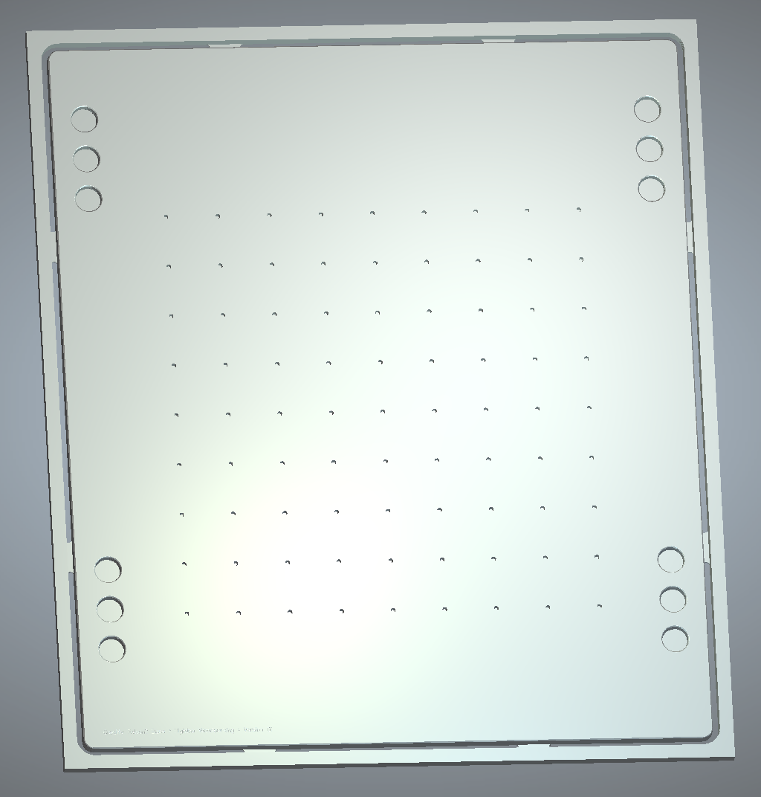

# Creality Falcon2 Base

Base plate for a [Creality Falcon2 Laser](https://www.creality.com/products/creality-falcon2-22w).  Provides a secure foundation for the frame and supports precise, repeatable positioning of work pieces.

## Notes

* drawing units are mm
* 650 x 744mm blank
* 12.7mm (1/2 inch) MDF
* TODO: machining

## Files

* base_v01.art = [Carveco Maker](https://carveco.com/carveco-software-range/carveco-maker/) source file
* base_v01.dxf = [DXF](https://en.wikipedia.org/wiki/AutoCAD_DXF) source file 

## Versions

* v01 | 10-Feb-2025 | inital post

