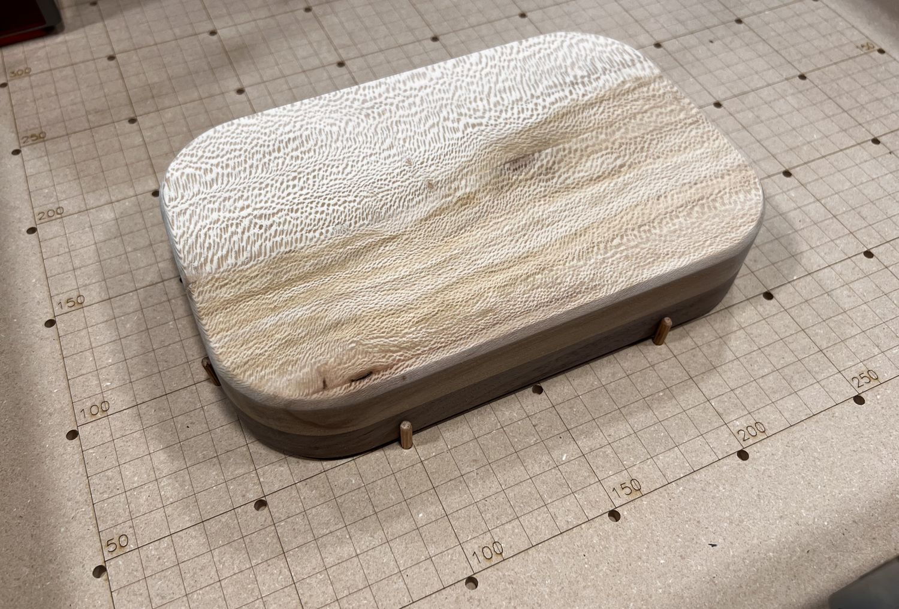

# Engraving the Reference Grid

A G-code file to engrave a reference grid on the MDF base is included with the project.  The grid in combination with the alignment holes/pins can be used to precisely position and engrave a piece using known coordinates.  For example, in the figure below the lower-left corner of the piece is positioned at exactly 50,50 (mm).  The reference grid will be 400 x 415mm which covers the extents of the Falcon2 working area.

